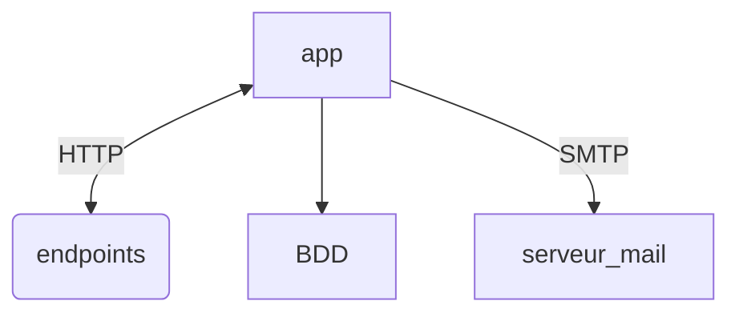

# Conception_logiciel_projet
## run the following command

```
uvicorn app.main:app --reload
```

# Bobby envoie des mails

Pour cela, Bobby utilise une super API.
Il peut y poster ses demandes d'envoi sur le endpoint post /demande.
Il peut updater une demande grâce au endpoint /demande{id}/update
Il peut récupérer toutes les demandes sur /demande/all.
Enfin, il peut connaître les demandes qui doivent être envoyées grâce à /demande/check_and_send


# Diagramme d'architecture



# Bug identifiés accessibles par # TODO